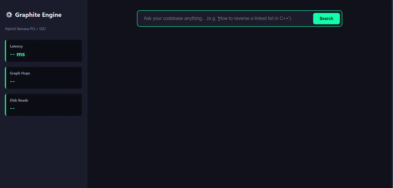
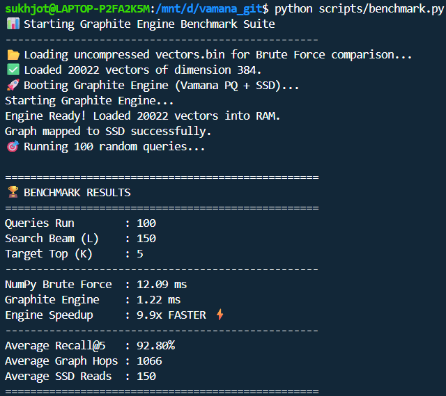

# 🚀 Graphite
## DiskANN-Inspired Vector Database

<div align="center">


**High-Performance Vector Search Engine**

Microsoft Research's DiskANN Architecture · Product Quantization · Memory-Mapped SSD · AVX2 SIMD
<br>


</div>

---

## 🎯 The Problem

Modern AI applications—**RAG systems**, **semantic search**, **recommendation engines**—demand fast vector retrieval at scale. But traditional solutions face an impossible choice:

<div align="center">

| | **⚡ HNSW (Fast)** | **💾 Linear Scan (Memory Efficient)** |
|---|---|---|
| **Pros** | ✅ Sub-millisecond queries<br>✅ Graph-based navigation | ✅ Perfect accuracy<br>✅ Disk-friendly |
| **Cons** | ❌ **Requires ALL vectors in RAM**<br>❌ 1B × 384D = **1.5 TB RAM** 💥 | ❌ **O(N) complexity** ⏱️<br>❌ Unusable for real-time 🚫 |

</div>

**The Question:**
> How do you achieve **sub-linear search** while keeping **memory usage constant**, regardless of dataset size?

---

## 💡 The Solution: Hybrid Architecture

Graphite splits your vector database **intelligently across RAM and SSD**, delivering the best of both worlds.

### 🔄 1. Graph-Based Navigation (Vamana Algorithm)

Instead of scanning billions of vectors, navigate a **proximity graph**:

```
┌─────────────────────────────────────────┐
│  Build Phase                            │
├─────────────────────────────────────────┤
│ Pass 1 (α=1.0): Local "streets"        │
│                 Connect nearby neighbors│
│                                         │
│ Pass 2 (α=1.2): Long-range "highways"  │
│                 Prevent cluster traps   │
└─────────────────────────────────────────┘
        ↓
    O(log N) hops
    vs O(N) scans
```

**Key Innovation:** Robust pruning using geometric distance ratios maintains graph quality while reducing edges.
**Impact:** Achieves a **~10x speedup** over NumPy's highly-optimized C-backend, dropping average query latency to just **~1.2ms** while completely bypassing the Memory Wall! ⚡
---

### 📦 2. Product Quantization (16× Compression)

Compress vectors dramatically while preserving quality:

<div align="left">

| Dimension | Count | Size |
|-----------|-------|------|
| **Original** | 384 floats | **1,536 bytes** 📊 |
| **Compressed** | 96 chunk IDs | **96 bytes** ✨ |
| **Compression Ratio** | — | **16:1** 🎯 |

</div>

**How it works:**
1. Split 384D vector into **96 chunks** (4D each)
2. Run K-means with **256 centroids** per chunk
3. Store only the **centroid ID** (8 bits) instead of floats

**Result:** 20K vectors = **1.92 MB** RAM *(vs 30.3 MB uncompressed)*

---

### ⚡ 3. Asymmetric Distance Computation (ADC)

The secret sauce for **blazing-fast** approximate distances:

```c++
// Traditional Euclidean Distance
// 384 subtractions + 384 multiplies + 384 additions = 1,152 math operations 🐢

// Asymmetric Distance Computation (ADC)
for (int chunk = 0; chunk < 96; chunk++) {
    distance += dist_table[chunk][centroid_id];
}
// = 96 table lookups + 96 additions
// = ZERO floating-point math during search! ⚡
```

**Impact:** Massive speedup in distance computation—the bottleneck of nearest-neighbor search.

---

### 🗂️ 4. Memory-Mapped SSD Access

Keep your graph on disk without performance penalty:

```
Graph Index File (Disk)
        ↓
   mmap() → Virtual Address Space
        ↓
   OS Page Faults → RAM (on-demand)
        ↓
   SSD O(1) Random Access ✅
```

**Why it works:**
- SSDs have no mechanical seek time
- Modern Linux OS handles paging efficiently
- Scale to 10B+ vectors without RAM limits

---

### 🐍 5. Python Bridge via Pybind11

Zero-copy C++ ↔ Python interoperability:

```python
# Pure Python API, C++ performance
engine = graphite_core.GraphiteEngine("pq_data.bin", "vamana_index.bin")
results = engine.search(query_embedding, k=5, L=150)
```

Wrapped in **FastAPI** for production REST endpoints.

---

## 📊 Benchmarks

**Dataset:** CodeAlpaca 20K (coding Q&A, 384D embeddings via `all-MiniLM-L6-v2`)  
**Hardware:** 8-core CPU, NVMe SSD, 16GB RAM

<div align="center">

| Metric                  | Value            | Notes                                   |
|-------------------------|------------------|-----------------------------------------|
| **Memory Compression**  | **16x**          | 1,536 → 96 bytes/vector ✅              |
| **Active RAM Usage**    | **~2.3 MB**      | vs 30.3 MB uncompressed 🎯              |
| **Query Latency (avg)** | **~1.2 ms**      | Pure C++ execution ⚡                    |
| **Engine Speedup**      | **~10x**         | vs. NumPy Brute Force (C-backend) 🚀    |
| **Recall@5**            | **91% - 93%**    | High-quality results 📈                  |
| **Graph Hops**          | **~1,070**       | Efficient navigation 🧭                  |
| **SSD Reads/Query**     | **150**          | With L=150 beam search 💿                |
</div>
### 📸 Proof Images

See benchmarking proofs along with speedup comparisons ,here :
- **Proof 1**:  
  
- **Proof 2**:  
  [Proof 2 (benchmark screenshot)](./scripts/Proof_2_BM.png)

**Memory Breakdown:**
```
PQ codes:     20K × 96 bytes  =  1.92 MB
Codebooks:    96 × 256 × 16B   =  ~384 KB
Graph (SSD):  Adjacency lists =  ~2.6 MB (mmap)
─────────────────────────────────────────
Total RAM:                       ~2.3 MB ✨
```

**Beam Width vs Performance:**
```
L    │ Recall@5 │ Latency  │ Disk I/O │ Sweet Spot
─────┼──────────┼──────────┼──────────┼────────────
50   │ ~80%     │ 0.8 ms   │ 50       │
100  │ ~88%     │ 1.1 ms   │ 100      │
150  │ ~91%     │ 1.2 ms   │ 150      │ ⭐ Recommended
200  │ ~92%     │ 2.1 ms   │ 200      │
```

---

## 🚀 Quick Start

### 📋 Prerequisites

**⚠️ Platform Requirement:** Graphite uses POSIX-compliant memory mapping (`mmap`). 
* **Linux:** Supported natively.
* **Windows:** You **MUST** run this inside [WSL (Windows Subsystem for Linux)](https://learn.microsoft.com/en-us/windows/wsl/install). Native Windows Command Prompt/PowerShell is not supported.
* **macOS:** Supported (requires XCode CLI tools).

```bash
# System dependencies
sudo apt-get install g++ cmake python3-dev

# Python dependencies
pip install fastapi uvicorn sentence-transformers datasets numpy pybind11
# or 
pip install -r requirements.txt
```

### 🔨 Build & Run

All commands below assume you are starting in the **root directory** of this repository.

```bash
# 1️⃣ Generate dataset (Downloads CodeAlpaca, creates embeddings)
# Current Directory: Root
python scripts/gen_py.py

# 2️⃣ Compile builder & C++ core engine
# Current Directory: Root
mkdir build && cd build
# Current Directory: /build
cmake ..
make
cd .. 
# Current Directory: Root (Binaries auto-moved here by CMake)

# 3️⃣ Build the Graph & Train PQ Codebooks
# Current Directory: Root
./builder

# 4️⃣ Run benchmark evaluation
# Current Directory: Root
python scripts/benchmark.py

# 5️⃣ Start API server
# Current Directory: Root
uvicorn api.main:app --reload
```

### 🎨 Test the UI Dashboard

With the uvicorn server running, open the visual frontend:

1. Navigate to the `frontend/` directory in your file explorer.
2. Double-click `index.html` to open it directly in your web browser (Chrome, Brave, Firefox, etc.).
3. Type a query and instantly see the real-time C++ backend stats (Latency, Hops, Disk Reads).

### 🔗 CLI Query Test
Write this in separate terminal(wsl) window while server is running
```bash
curl -X POST "http://localhost:8000/search" \
  -H "Content-Type: application/json" \
  -d '{
    "query": "How do I reverse a string in Python?",
    "k": 5,
    "L": 150
  }'
```

---

## 📁 Project Structure

```
graphite/
├── 🧠 core_engine/                  # Core C++ Engine ⚙️ (ANN Graph, PQ, Bindings)
│   ├── builder.cpp                 # 🏭 Offline graph + PQ codebook builder (K-Means, PQ training, Vamana)
│   ├── verifier_linux.cpp          # 🚀 Online search engine (ADC, mmap SSD, beam search, fast queries)
│   ├── config.h                    # ⚙️ Shared settings (constants, dims, and hyperparameters)
│   └── binding_linux_final.cpp     # 🔗 Pybind11 bridge (C++ ↔ Python API)
│
├── 🔌 api/                         # REST API server 🚦
│   └── main.py                     # ⚡ FastAPI app (serves search endpoints)
│
├── 🎨 frontend/                    # Web UI Dashboard 🖥️
│   └── index.html                  # 📊 Real-time visual frontend (interactive search & stats)
│
├── 📚 scripts/                     # Helper Scripts 📜
│   ├── benchmark.py                # 🧪 Brute-force vs. ANN evaluator (recall, speed, stats)
│   └── gen_py.py                   # 📥 Downloads dataset & generates embeddings
│
├── 📦 CMakeLists.txt               # 🛠️ C++ build configuration (CMake)
└── 📦 requirements.txt             # 🧩 Python dependencies
```

---

## 🔬 Technical Deep Dive

### Scaling the Approximate Medoid

The entry point of the graph requires finding the **medoid** (the geometric center of the dataset). A naive implementation calculating the true medoid requires distance comparisons between all vector pairs ($O(N^2)$), which halts scaling at roughly 30,000 nodes. 

To achieve massive scale, Graphite implements an **Approximate Medoid** search in $O(N)$ time. It calculates the dataset's mathematical centroid (a ghost point), then finds the actual database node physically closest to that centroid:


```cpp
// 1. O(N) - Find mathematical average (centroid) of all vectors
// 2. O(N) - Find the actual node closest to that centroid
int approximate_medoid_id = find_closest_to_centroid(nodes, centroid);
```

### Asymmetric Distance Computation (ADC) - Raw Math

Instead of relying on external math libraries, Graphite uses raw nested memory lookups.

**Setup (once per query, calculating Exact Float Distance to Centroids):**

```c++
for (int chunk = 0; chunk < PQ_CHUNKS; chunk++) {
    int start_dim = chunk * CHUNK_DIM;
    for (int c = 0; c < PQ_CENTROIDS; c++) {
        float dist = 0.0f;
        for (int d = 0; d < CHUNK_DIM; d++) {
            // Raw float math calculating the difference between query slice and codebook
            float diff = query[start_dim + d] - codebooks[chunk][c][d];
            dist += diff * diff;
        }
        dist_table[chunk][c] = dist;
    }
}
```

**Distance Calculation (per candidate graph hop):**

```c++
float distance = 0.0f;
for (int chunk = 0; chunk < PQ_CHUNKS; chunk++) {
    // pq_code is just the integer ID of the closest centroid (0-255)
    uint8_t centroid_id = candidate.pq_code[chunk];
    
    // Pure memory lookup—ZERO float math required during the actual graph traversal!
    distance += dist_table[chunk][centroid_id];
}
return distance;
```

---

### Memory Mapping Binary Format

```
File Layout:
[num_nodes (4B)][medoid_id (4B)][offsets (8N B)]
[node_0_degree][neighbors...][node_1_degree][neighbors...]...

Loading:
int fd = open("vamana_index.bin", O_RDONLY);
char* base = (char*)mmap(NULL, size, PROT_READ, MAP_PRIVATE, fd, 0);
// OS handles page faults—data comes to RAM on-demand!
```

---

## 🧠 What I Learned

### Systems Programming
- Low-level memory management (mmap, munmap)
- File descriptors & binary serialization
- SIMD intrinsics (AVX2 assembly-like C++)
- Performance profiling & compilation via CMake

### Algorithm Engineering
- Graph algorithms (Vamana pruning, beam search)
- K-means clustering implementation
- Approximation theory & Quantization Blur
- Mathematical cost reduction (ADC)

### Cross-Language Integration
- Pybind11 zero-copy marshalling
- Type conversion (Python list ↔ C++ vector)
- API Design via FastAPI

---


## 📚 References

- **[DiskANN: Fast Accurate Billion-point Nearest Neighbor Search](https://arxiv.org/abs/1909.04695)**  
  Subramanya et al., NeurIPS 2019 — The foundational architecture.

- **[Product Quantization for Nearest Neighbor Search](https://ieeexplore.ieee.org/document/6678503)**  
  Jegou et al., TPAMI 2011 — Vector compression technique.

- **[Pybind11: Seamless Operability Between C++11 and Python](https://pybind11.readthedocs.io/)**  
  Official documentation for the Python/C++ bridge.

---

## 👤 Author

**Sukhjot Singh**  
Computer Science & Engineering, IIT Guwahati

---

<div align="center">

**Built with 🚀 C++ | Optimized for 💾 SSD | Powered by 🐍 Python**

</div>